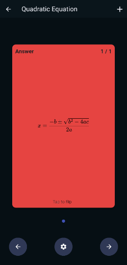
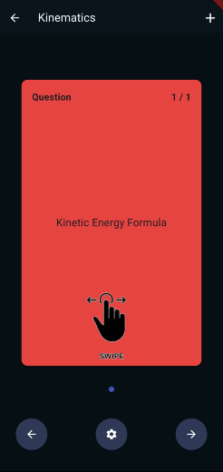

# RecallX - Flashcard App

RecallX is an intuitive and efficient flashcard app designed to enhance your learning experience. Flashcards support active recall by creating neural pathways, which make it easier to call up information at a future date. Flashcards aren’t just for rote memorization and can be used for more complex tasks if designed correctly.

## Features

- **Organize Content:**
  Categorize your flashcards by subjects and chapters for better organization.

- **Interactive Learning:**
  Swipe through flashcards and tap to reveal answers for an interactive learning experience.

- **Advanced Formulas:**
  Input mathematical formuals and chemical equations with the complex type.

## Getting Started

1. **Download and Install:**
   - [Download apk](https://kewll.fun/recallX/recallX.apk) (for Android users)
2. **Explore Subjects:**

   - Add your subjects and chapters to get started.

3. **Create Flashcards:**
   - Populate your chapters with flashcards for effective study sessions.

## Screenshots

Happy Learning! 📚✨
